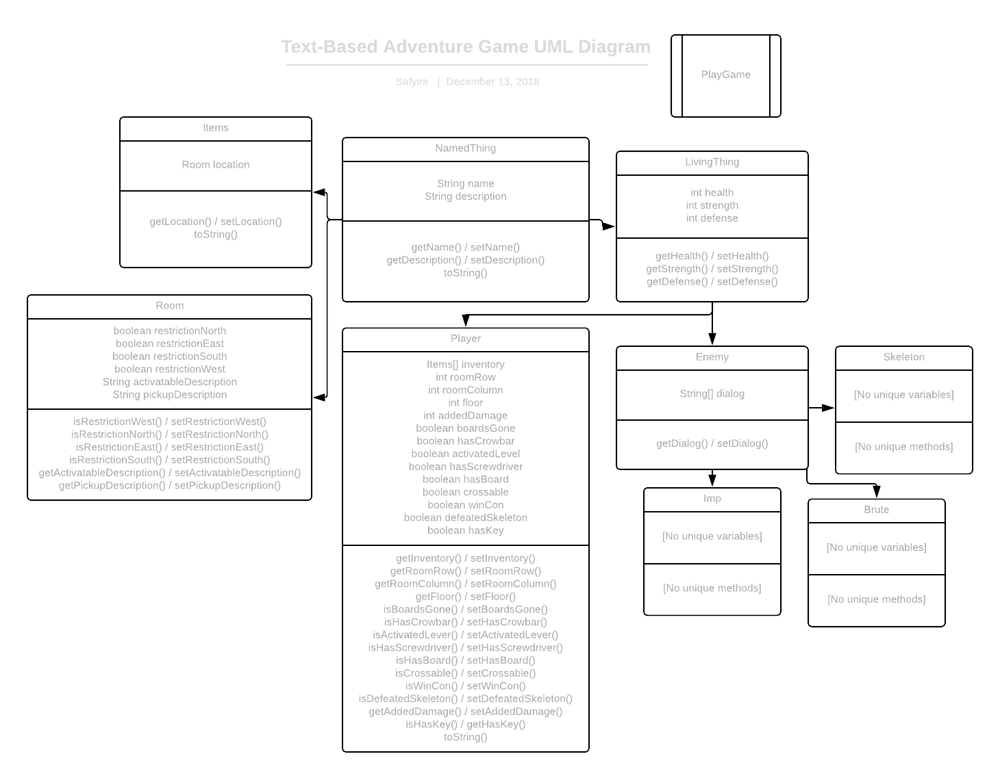

# Doot Doot 2: Electric Boogaloo

hi 3rd period fall 2019 -pie

## The Story
...Huh?! The last thing you remember before passing out and waking up in this suspicious-looking spaceship was eating some good beans. This spaceship looks preeeety intricate, but somehow you manage to send an SOS to your home world after finding out you still have your phone with you. Cool.

While you're here, you might as well try to escape. The ship doesn't have fuel anymore, but there's a lot of damage on the control panel, so you know that you're not the only one aboard.

You walk around finding *anything* that would be useful to your escape. You find out you were right earlier, and the ship is infested with large imps and, cat brutes, and annoying gaps and trapdoors. Luckily for you, you CAN escape with what they gave you, ~~providing you with~~ hiding crowbars, levers, and a classic screwdriver. I guess it was just a normal Friday afternoon after all—

```
                               _.--""-._
  .                         ."         ".
 / \    ,^.         /(     Y             |      )\
/   `---. |--'\    (  \__..'--   -   -- -'""-.-'  )
|        :|    `>   '.     l_..-------.._l      .'
|      __l;__ .'      "-.__.||_.-'v'-._||`"----"
 \  .-' | |  `              l._       _.'
  \/    | |                   l`^^'^^'j
        | |                _   \_____/     _
        j |               l `--__)-'(__.--' |
        | |               | /`---``-----'"1 |  ,-----.
        | |               )/  `--' '---'   \'-'  ___  `-.
        | |              //  `-'  '`----'  /  ,-'   I`.  \
      _ L |_            //  `-.-.'`-----' /  /  |   |  `. \
     '._' / \         _/(   `/   )- ---' ;  /__.J   L.__.\ :
      `._;/7(-.......'  /        ) (     |  |            | |
      `._;l _'--------_/        )-'/     :  |___.    _._./ ;
        | |                 .__ )-'\  __  \  \  I   1   / /
        `-'                /   `-\-(-'   \ \  `.|   | ,' /
                           \__  `-'    __/  `-. `---'',-'
                              )-._.-- (        `-----'
                             )(  l\ o ('..-.
                       _..--' _'-' '--'.-. |
                __,,-'' _,,-''            \ \
               f'. _,,-'                   \ \
              ()--  |                       \ \
                \.  |                       /  \
                  \ \                      |._  |
                   \ \                     |  ()|
                    \ \                     \  /
                     ) `-.                   | |
                    // .__)                  | |
                 _.//7'                      | |
               '---'                         j_| `
                                            (| |
                                             |  \
                                             |lllj
                                             ||||| 
```

Oh yeah. That's not good. 

A mob of enemies can't be complete without a leader, after all. See for yourself if you can beat this dastardly doot!

## The UML Diagram

